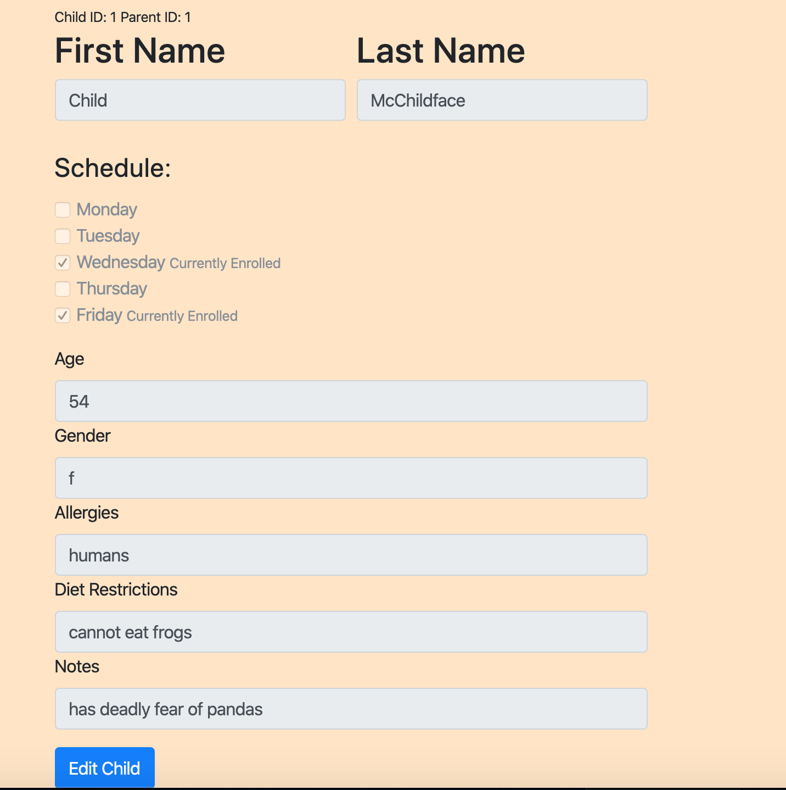
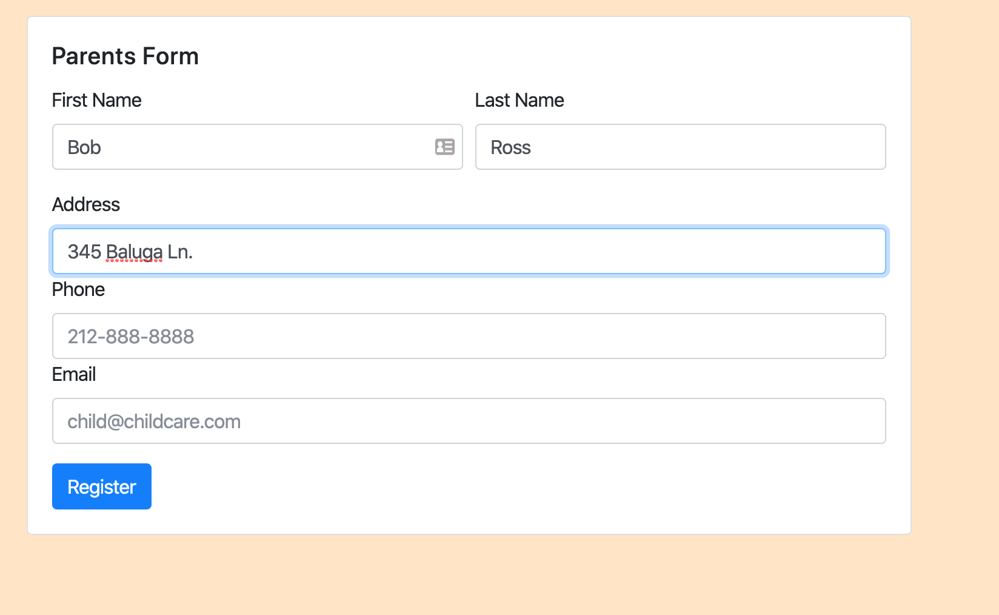
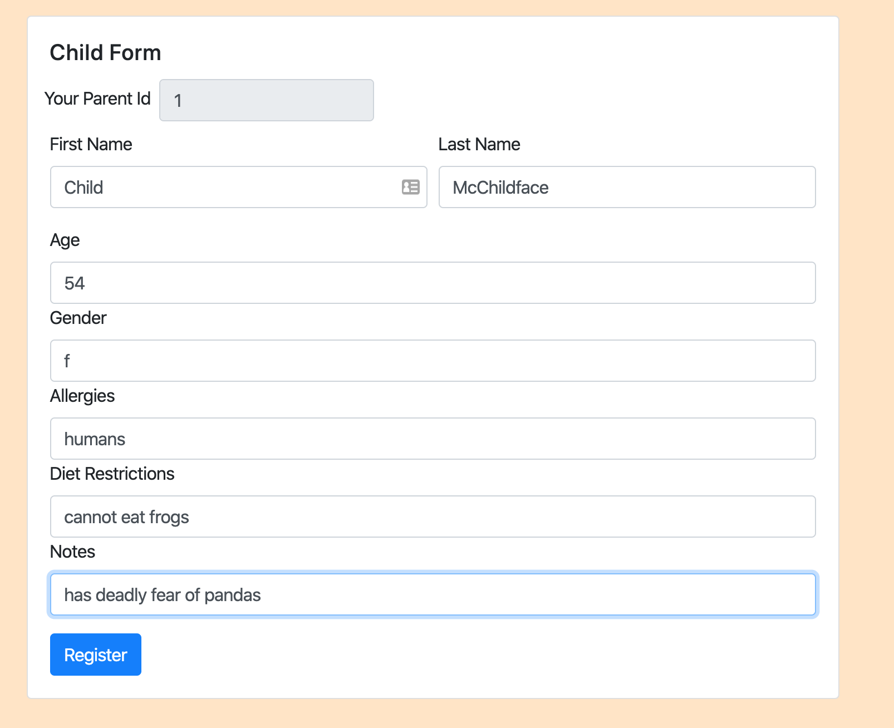
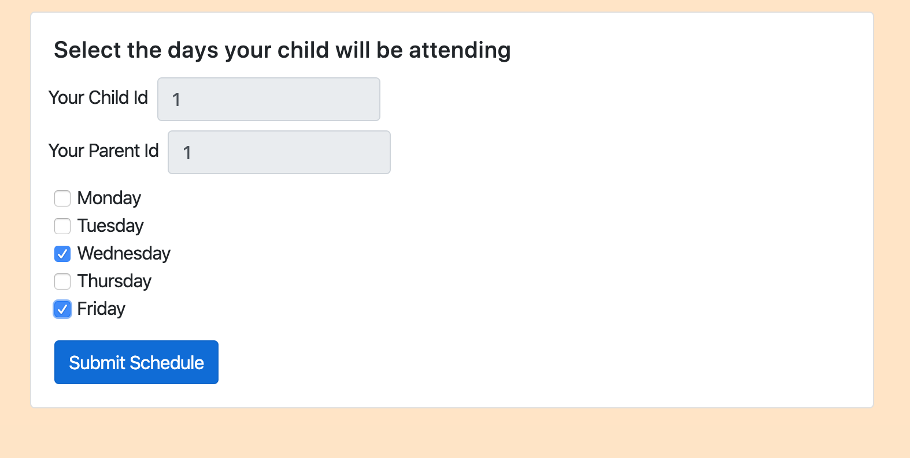
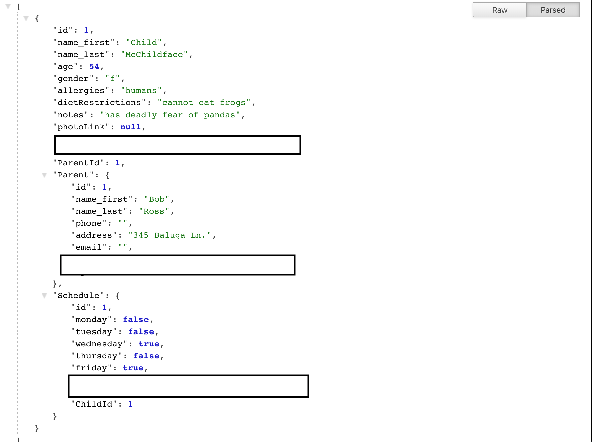
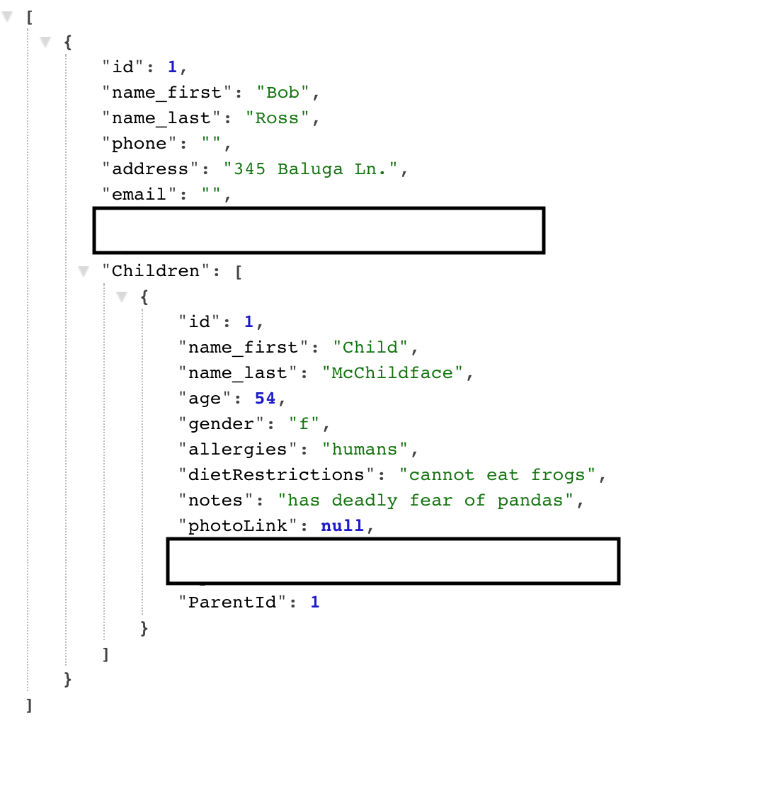
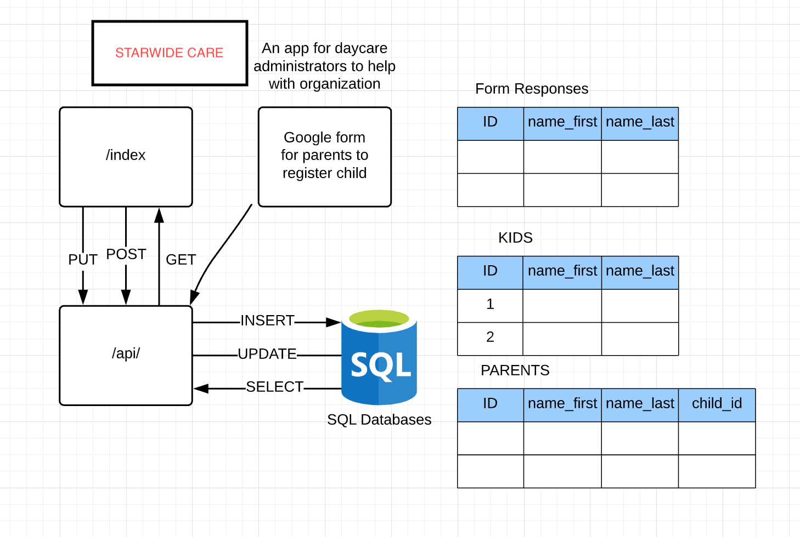
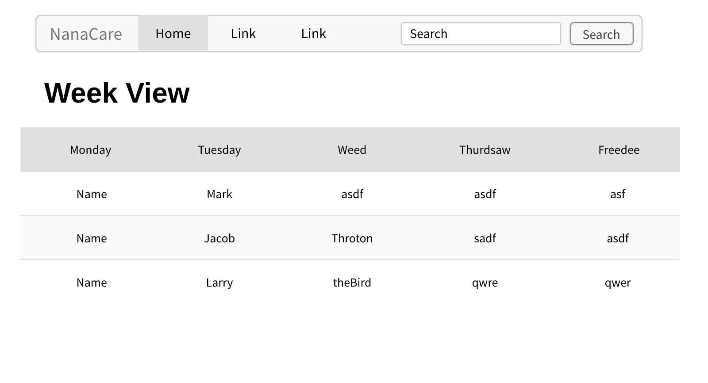

# STARWIDE CARE

## [Heroku Deployment]()

# Table of Contents

1. [About](#about)
2. [How To](#howto)
3. [run](#run)
4. [Screenshots](#screenshots)
5. [Reference](#reference)

## About

STARWIDE CARE is an application for daycare administrators to easily organize and register children.

#### Features:-

- Easy week view to display the children who will be attending organized by the day of the week.
- Includes form system for parents to register their children and select the days they will be attending.
- Simple to use and understand interface.
- Clickable links to display more info on a child including age, gender, allergies, and other notes. (indevlopment)
- Edit and change Child data and thier schedules with clickable links. (indevlopment)

## Guide

- To register a parent, their child, assign the child days to attend, and register more children, use the form in the bottom right corner labeled "Begin Registration".
- Data will be displayed on the home page.
- Details about a child can be viewed and edited by clicking on a child's name in week view

## Run

To run the app locally, node must be installed in your terminal.
Run the following to initialize:

```
$ npm init
$ npm instal
```

Run the following in the main directory to start app onl localhost port 3000

```
$ node server
```

## Contributors

Japkirat Singh

## Screenshots

### App Views




### Form Views





### Api Views




## Reference

### Website Schema



### Mockups



